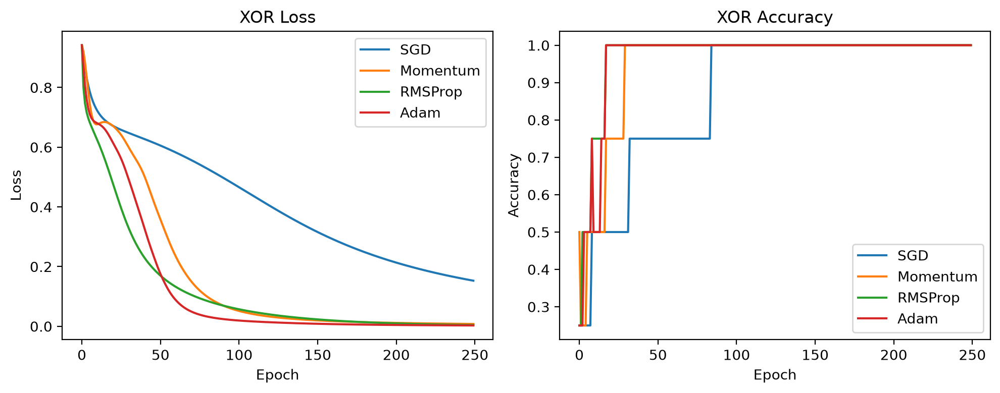
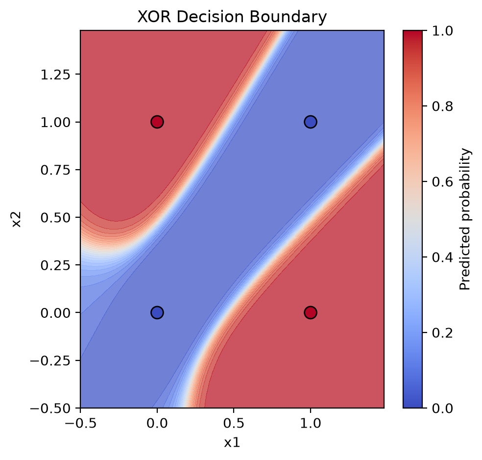
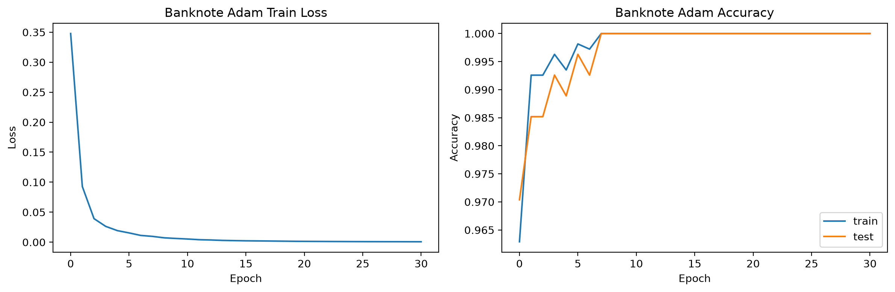

# ScalarGrad

ScalarGrad is a tiny scalar-valued automatic differentiation engine and neural-network library built from scratch in Python. It starts with a micrograd-style `Value` object, then extends it into MLP classifiers, binary cross entropy training, multiple optimizers, and reproducible visual experiments.

## Highlights

- Reverse-mode autodiff over scalar computation graphs
- Neural-network modules: `Neuron`, `Layer`, `MLP`
- Configurable activations: `tanh`, `relu`, `sigmoid`, `linear`
- Binary MLP classifier with sigmoid probabilities and BCE loss
- Optimizers: `SGD`, `Momentum`, `RMSProp`, `Adam`
- XOR optimizer comparison with saved curves and decision boundary plot
- Real-world Banknote Authentication classifier with deduped train/test split
- Noisy XOR sanity check showing the model does not report perfect accuracy on contradictory labels

## Project Structure

```text
scalargrad/
  engine.py        # scalar autograd engine
  nn.py            # Module, Neuron, Layer, MLP
  classifier.py    # BinaryMLPClassifier and binary cross entropy
  optim.py         # SGD, Momentum, RMSProp, Adam
  datasets.py      # XOR, noisy XOR, banknote loading, splits, scaling
  plotting.py      # decision boundary visualization
  visualize.py     # Graphviz computation graph visualization
examples/
  train_mlp.py
  compare_xor_optimizers.py
  train_banknote.py
  noisy_xor_sanity_check.py
notebooks/
  ScalarGrad.ipynb
tests/
  test_engine.py
  test_classifier.py
  test_optim.py
data/
  banknote_authentication.txt
```

## Quick Start

```bash
pip install -r requirements.txt
python -m pytest
```

Run the original toy MLP demo:

```bash
python examples/train_mlp.py
```

Compare optimizers on XOR and save plots/results:

```bash
python examples/compare_xor_optimizers.py
```

Train on the UCI Banknote Authentication dataset:

```bash
python examples/train_banknote.py
```

Run the noisy XOR sanity check:

```bash
python examples/noisy_xor_sanity_check.py
```

Generated artifacts are written to `outputs/`, including CSV metrics and PNG plots.

## Minimal Autograd Example

```python
from scalargrad import Value

a = Value(2.0)
b = Value(-3.0)
c = a * b + 10
c.backward()

print(c.data)  # 4.0
print(a.grad)  # -3.0
print(b.grad)  # 2.0
```

## Binary Classification Example

```python
import random
from scalargrad import Adam, BinaryMLPClassifier
from scalargrad.datasets import make_xor

xs, ys = make_xor()
random.seed(42)
model = BinaryMLPClassifier(2, [4, 4], activation="tanh")
optimizer = Adam(model.parameters(), lr=0.03)

for _ in range(250):
    loss = model.loss(xs, ys)
    optimizer.zero_grad()
    loss.backward()
    optimizer.step()

print([model.predict(x) for x in xs])
```

## Results

On clean XOR, all optimizers reach 100% accuracy, but Adam, RMSProp, and Momentum converge faster than plain SGD. On noisy XOR with 25% intentionally flipped labels, accuracy saturates around 75%, which validates that the evaluation is not artificially inflated. On the deduplicated Banknote Authentication dataset, the Adam-trained MLP reaches very high test accuracy with a clean train/test split and train-only standardization.

## Visual Results

### XOR Optimizer Comparison



### XOR Decision Boundary



### Banknote Training Curves


